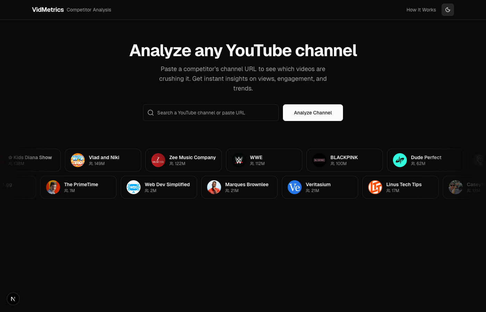
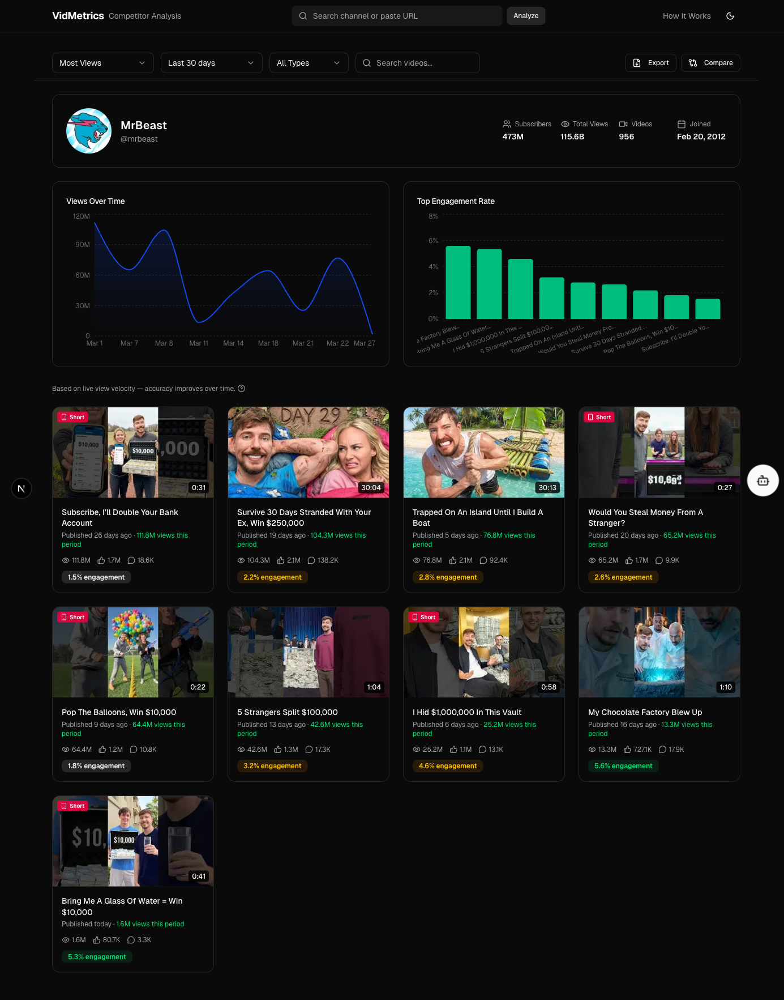
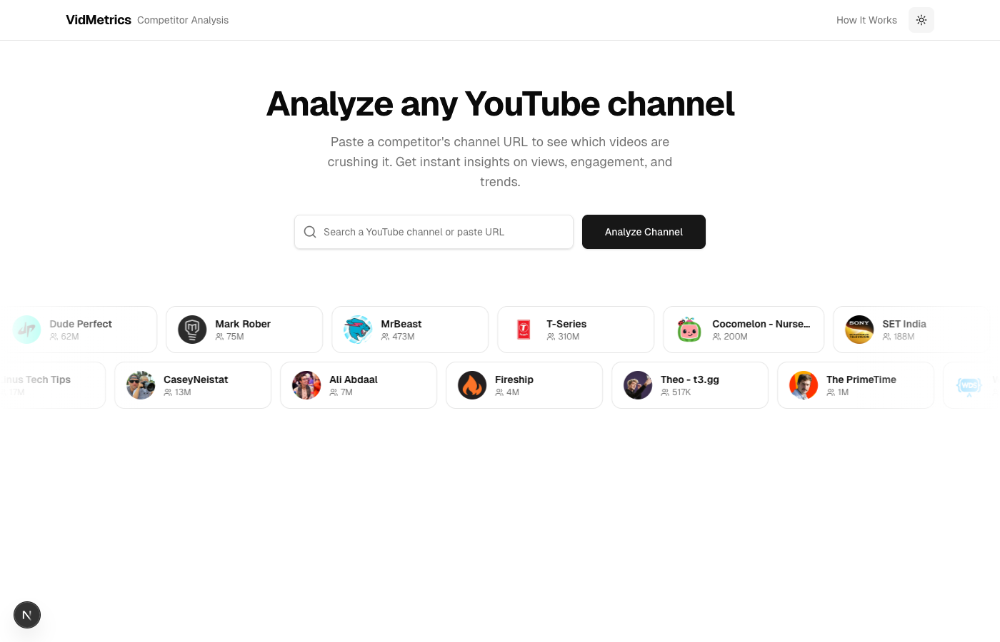

# VidMetrics - YouTube Competitor Analysis

Analyze any YouTube channel's performance. Paste a channel URL, and VidMetrics shows you which videos are crushing it with views gained over time, engagement rates, interactive charts, head-to-head channel comparisons, and AI-powered insights.



## Features

### Channel Analytics Dashboard

Search any YouTube channel by name or URL and get a full breakdown of their recent performance:

- **Channel overview** with subscriber count, total views, video count, and join date
- **Views Over Time** line chart showing view trends across the selected date range
- **Top Engagement Rate** bar chart ranking videos by likes + comments relative to views
- **Video grid** with thumbnails, view counts, likes, comments, and engagement badges
- **Sort & filter** by most views, newest, oldest, or highest engagement
- **Period selector** for last 7, 14, 30, 90 days, or custom date range
- **Video type filter** to isolate Shorts, long-form, or live streams



### View Tracking System

YouTube's API only provides lifetime view counts. VidMetrics solves this with a snapshot-based tracking system that calculates **views gained within a specific date range**:

| Data Source | How It Works |
|---|---|
| **Estimated** | First visit: age-weighted average from lifetime views |
| **Velocity** | Two snapshots minutes apart: real views/minute extrapolated to the full range |
| **Tracked** | Two snapshots spanning 80%+ of the range: exact delta |

Accuracy improves automatically the longer a channel is tracked. A daily cron job snapshots all tracked channels at midnight UTC.

### Head-to-Head Channel Comparison

Compare two channels side by side via URL (`/channel/MrBeast?vs=PewDiePie`):

- Side-by-side stat cards with winner highlighting
- Overlaid views and engagement charts
- Aggregate head-to-head stats (avg views, engagement, content mix)
- Ranked top-10 video lists for both channels
- Shareable/bookmarkable comparison URLs

### AI-Powered Insights

Powered by **Gemini 2.0 Flash**, the AI features provide:

- **Channel Health Score** with detailed breakdown
- **Content recommendations** based on performance patterns
- **Head-to-head analysis** in comparison mode with per-channel advantages
- **Interactive chat** to ask follow-up questions about the channel's data
- Cached for 6 hours, rate-limited per IP

### PDF Export

Export any channel analysis (or comparison) as a formatted PDF report with charts, stats, and video tables.

### Dark & Light Mode

Full theme support with dark, light, and system-preference modes.

<details>
<summary>Light mode preview</summary>



</details>

### Trending Creator Carousel

The homepage features an infinite scrolling marquee of 24 trending YouTube creators, updated every 24 hours.

## Tech Stack

| Layer | Technology |
|---|---|
| Framework | Next.js 16 (App Router, React 19, TypeScript) |
| Styling | Tailwind CSS v4, shadcn/ui |
| Charts | Recharts 3.x |
| Database | Neon PostgreSQL (serverless) via Prisma 7 |
| AI | Gemini 2.0 Flash via Vercel AI SDK |
| PDF Export | html2canvas + jspdf |
| Deployment | Vercel |

## Getting Started

### Prerequisites

- Node.js 18+
- A [YouTube Data API v3](https://console.cloud.google.com/) key
- A [Neon](https://neon.tech/) PostgreSQL database
- A [Google AI Studio](https://aistudio.google.com/) API key (for Gemini)

### Setup

1. Clone the repo and install dependencies:

```bash
git clone https://github.com/Staniell/vidmetrics-app.git
cd vidmetrics-app
npm install
```

2. Create a `.env.local` file:

```env
YOUTUBE_API_KEY=your_youtube_api_key
DATABASE_URL=your_neon_connection_string
CRON_SECRET=your_cron_secret
GOOGLE_GENERATIVE_AI_API_KEY=your_gemini_api_key
```

3. Set up the database and generate the Prisma client:

```bash
npx prisma db push
npx prisma generate
```

4. Start the dev server:

```bash
npm run dev
```

Open [http://localhost:3000](http://localhost:3000) to start analyzing channels.

## Scripts

```bash
npm run dev          # Start dev server
npm run build        # Production build
npm run lint         # ESLint
npx prisma db push   # Push schema changes to database
npx prisma generate  # Regenerate Prisma client
```

## YouTube API Quota

Free tier allows 10,000 units/day. Each channel lookup costs ~3 units, allowing roughly 3,300 lookups per day. The daily cron snapshot uses ~1 unit per 50 tracked videos.

## Deploy

Deploy to Vercel and set the same environment variables from `.env.local` in your Vercel project settings. The daily cron job is configured via `vercel.json`.

## License

MIT
